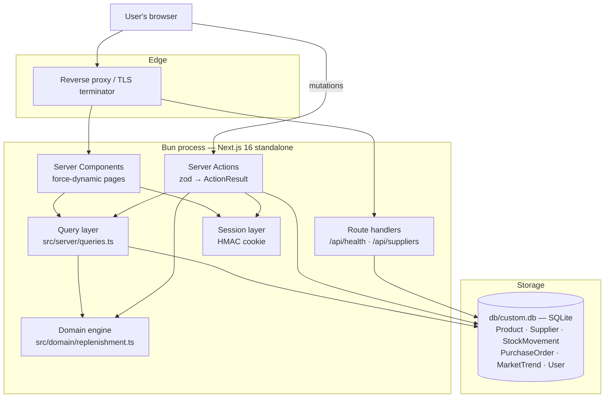
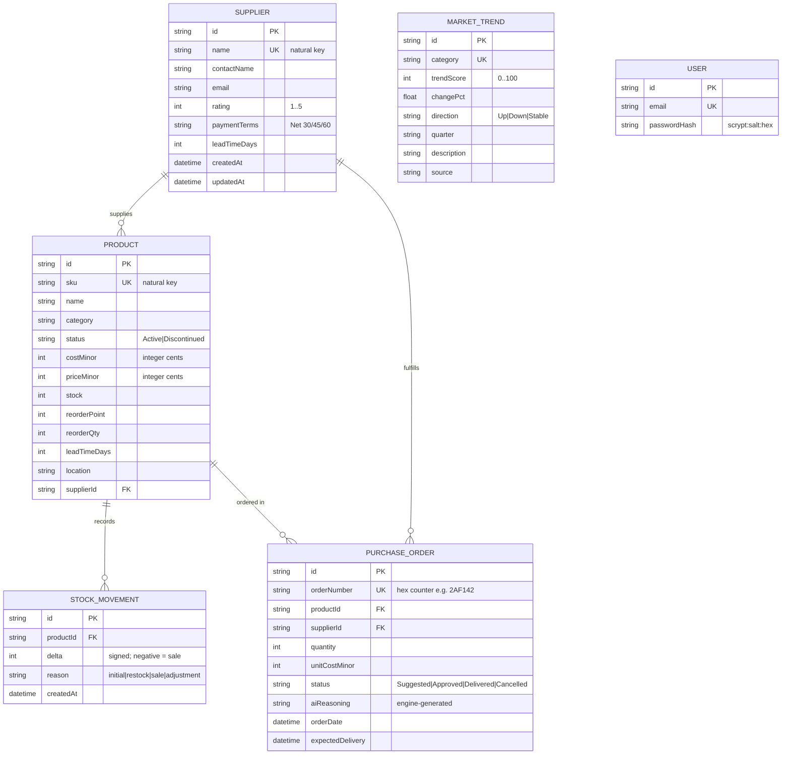

# Supply Chain Management — Master Project Architecture Document (PAD) v1.5

**Classification:** Internal Engineering Reference
**Status:** DEFINITIVE, PRODUCTION-LOCKED BLUEPRINT
**Companion Documents:** `README.md` (operator guide) · `AGENTS.md` (agent cheat-sheet) · `CLAUDE.md` (agent operating contract)
**Last Updated:** 2026-09-20 (Session 8 — webkit promoted from exploratory to blocking CI gate)
**Audience:** Senior Engineers, Tech Leads, DevOps, and Onboarding Engineers
**Rule:** Every architectural decision in this document traces to a specific rationale. Nothing is here "because it's popular."

---

#### Revision Block — v1.5 (Tracked Changes)

- `[CIC]` **WebKit E2E promoted to a blocking CI gate** (`continue-on-error` removed from the `e2e-webkit` job; job renamed `E2E (webkit, exploratory)` → `E2E (webkit)`). Promotion evidence: webkit green on hosted-CI runs #5/#6, one root-caused flake on #7 (fixed two-layer in v1.4 with a deterministic local red/green proof), then **three consecutive post-fix green runs #8/#9/#10** (81s / 1m38s / 1m35s) — the v1.4 remediation holding under real shared-runner conditions. A webkit failure now blocks main exactly like chromium; the public-annotation diagnosability pipeline (v1.3) and the `if: always()` results-summary steps are unchanged, so a future failure is still publicly diagnosable. Local development is unaffected: webkit still needs system libraries locally — `--project=chromium` remains the documented local gate.

#### Revision Block — v1.4 (Tracked Changes)

- `[TST]` **WebKit E2E hydration-race flake diagnosed and fixed (two layers).** Hosted-CI run #7 (a docs-only commit — bit-identical app code to the green runs #5/#6) failed one webkit test, `Products › search filters the catalog`, at the 5s `expect` timeout: the job finished in 1m41s (shorter than the green 1m53s), proving a fast assertion failure, not a 60s test-timeout burn. Root cause class: **Playwright actions don't retry (assertions do)** — on a slow shared runner, `fill`+`Enter` can land before the products page's client island hydrates, so the submit is unwired and the URL never gains `?q=`. Fix layer 1 (spec): the interact→assert block is wrapped in `expect(async () => { … }).toPass()` (2s inner attempts, 20s budget) — Playwright's canonical remedy; local simulation (JS-bundle delay + `name="q"` stripped from SSR HTML) reproduced the failure with the old pattern and proved the retry rescues it deterministically. Fix layer 2 (component): the search inputs in `products-filters.tsx` and `order-filters.tsx` carry `name="q"` — a pre-hydration Enter then triggers the browser's implicit GET submission with the correct query, and the server renders the filtered table; post-hydration the attribute is inert (`handleSubmit` preventDefaults, URL flow stays router-driven). All three interleavings (both-pre-hydration, wiped/unwired, post-hydration) are now deterministic.
- `[CIC]` **CI runners pinned to `ubuntu-24.04`** (was `ubuntu-latest`): GitHub announced the label migrates to Ubuntu 26 on 2026-10-19 (`actions/runner-images#14748`) — pinning freezes the runner image the gate was validated on (one image, one webkit system-deps story across both jobs); re-pin deliberately when updating.

#### Revision Block — v1.3 (Tracked Changes)

- `[SEC]` **Session cookie `Secure` flag now follows the request protocol, not `NODE_ENV`** (`src/lib/session.ts`): `secure: await isHttpsRequest()` — true only when the request arrived over TLS (`x-forwarded-proto`, first proxy-chain entry), false for direct plain-HTTP. Root cause of the hosted-CI webkit failure: production-mode E2E serves plain HTTP, and WebKit drops `Secure` cookies on non-HTTPS transports (even loopback) while Chromium trusts loopback — the sign-in round-trip was the only failing test (30/31 webkit passed, pinned via the new public annotation pipeline). Marking a cookie `Secure` on a plain-HTTP transport is a bug (browsers drop it), not a hardening — the fix is strictly more correct for TLS-terminated deployments too.
- `[CIC]` **Public E2E failure diagnosability:** Playwright JUnit output (`test-results/junit.xml`) feeds `scripts/e2e-summary.ts` (`bun run e2e:summary`), which appends a totals + per-failure markdown table to `$GITHUB_STEP_SUMMARY` AND emits `::error` workflow commands (≤10 per step, GitHub's cap) that render as **annotations on the public run page** — GitHub's raw logs and job-summary markdown are login-walled, but annotations are anonymous-readable, which is how the webkit failure was diagnosed without repo access. A fallback annotation fires when junit.xml is missing (suite crashed before reporting).
- `[CIC]` **CI actions on node24 majors:** `actions/checkout@v7`, `actions/upload-artifact@v7` (removes the Node-20 deprecation warnings from runs #1–#3); the webkit report artifact now includes `junit.xml`.
- `[TST]` **WebKit E2E green on hosted CI (run #5, 31/31):** the exploratory webkit project got a 60s per-test timeout (slower headless WebKit on shared runners; chromium's 30s gate unchanged) and the dashboard spec waits for `domcontentloaded` after `goBack()` (WebKit resolves history back before the bfcache page is interactive). Chromium gate stays the primary blocking job; webkit remains `continue-on-error` pending more green runs — promote by deleting that line once reliably green.
- `[RES]` **Sandbox-scaffold defense in `.gitignore`:** the automation workspace's harness occasionally auto-commits untracked files (it twice nearly staged `auth.json`, which stores agent-browser credentials); known scaffold paths are now ignored so stray harness commits can't leak them.

#### Revision Block — v1.2 (Tracked Changes)

- `[SEC]` **Session guard on admin actions (ADR-008):** the four lifecycle actions with no UI surface (`approveSuggestionAction`, `dismissSuggestionAction`, `updateOrderStatusAction`, `generateSuggestionsAction`) now refuse anonymous callers with `ActionResult` code `UNAUTHENTICATED` via the pure `requireSignedIn()` guard (`src/domain/guard.ts`). Reference-parity surfaces (public reads, New Product dialog, sign-in/up/out) intentionally stay open — the live reference serves the New Product form to anonymous visitors.
- `[SEC]` **Env contract wired:** `parseServerEnv()` was previously exported but never invoked (docs promised fail-fast validation; code never called it). Session HMAC signing now reads its secret through the memoized `getServerEnv()` seam (`src/lib/env.ts`), so a production boot with a missing/placeholder `SESSION_SECRET` fails on first session use — the documented contract is finally enforced. Dev keeps the safe default.
- `[TST]` **Coverage threshold gate:** `@vitest/coverage-v8` + `test:coverage` script; thresholds (statements 95 / branches 85 / functions 95 / lines 95) over the pure domain layer + env contract, measured at 97.9/90.9/100/100. Suite grew 52 → 85 tests (pinning tests for `velocityDelta`, `projectedStockAtLeadTime`, `needsReplenishment`, `forecastDemand`, `analyzeProduct`, `buildLedgerDaySeries`, `formatMoney`, `toActionResult` non-Error branch, and the new guard/env seams).
- `[CIC]` **Hosted CI:** `.github/workflows/ci.yml` runs the full gate (lint → typecheck → unit+coverage → db push/seed → verify:analytics → build → Playwright chromium) on every push/PR to main, plus an exploratory non-blocking webkit job.
- `[TYP]` `ActionResult` failure branch extracted to `ActionFailure` with new code `UNAUTHENTICATED` — denials are now assignable to any `ActionResult<T>` return type (guard returns `ActionFailure | null`).

#### Revision Block — v1.1 (Historical)

- `[SYN]` Initial blueprint: single-app Next.js 16 clone of the reference Base44 supply-chain application, adapted from the scandihaven foundation conventions (ActionResult boundaries, integer minor-unit money, derived analytics, strict TypeScript, provider-style pure seams) onto a Prisma/SQLite single deployable.
- `[CA]` Velocity rule locked to `min(150, days-since-first-sale)` windowing after it reproduced the reference app's exact derived numbers (225 sales/150d = 1.5; 110 sales/137d = 0.8) where a bare 150-day average did not.
- `[SR]` `buildAiReasoning` extended to four truth branches after audit found the three-branch version asserting "projected below reorder point" for a SKU whose projection (15) was above its trigger (10) — no reasoning sentence may contradict the data.
- `[SAN]` Seed credentials externalized to `SEED_DEMO_EMAIL`/`SEED_DEMO_PASSWORD` so no real credential is committed; defaults are safe demo values.
- `[PAR]` **Session 2 parity audit:** live reference inspection (computed styles, getBoundingClientRect, click instrumentation) extracted the true design tokens (`#FF9000` primary, `#EFEFEF` background, `#DFDFDF` inactive pills, `#F13A15` destructive, 32px card radius, system-ui body) and the reference interaction model (read-only list surfaces; Order/Review deep-link; Order Details side panel; supplier detail routes). All surfaces remediated to match.
- `[DAT]` **Reference data basis:** seed rewritten to the reference's real costs/prices/reorder quantities — inventory value now derives to **$202,610 exactly** (stock × cost); movers badges reproduce +2/−1/0/+1/+2; PO rows carry the reference supplier/cost/date pattern. The earlier "honest derivation over opaque demo data" trade-off (v1.0) is retired.
- `[TST]` **Test suites added (TDD):** Vitest unit suite (52 domain tests in `src/domain/*.test.ts`) and Playwright E2E suite (31 chromium tests in `e2e/`) wired via the repo-root `vitest.config.ts`/`playwright.config.ts` and `bun run test`/`test:e2e`.
- `[REA]` `REFERENCE_AI_REASONING` exported from the domain engine — the reference renders one static reasoning sentence for every suggestion; the parity surface uses it, while `buildAiReasoning` remains the generation engine for programmatic suggestions.

---

## Table of Contents

1. [System Overview & Decisions](#1-system-overview--decisions)
2. [High-Level System Topology](#2-high-level-system-topology)
3. [Application Architecture](#3-application-architecture)
4. [Data Architecture](#4-data-architecture)
5. [Design System Reference](#5-design-system-reference)
6. [Security Architecture](#6-security-architecture)
7. [Testing Strategy](#7-testing-strategy)
8. [Build & Deployment](#8-build--deployment)
9. [Developer Handbook](#9-developer-handbook)
10. [Known Issues & Outstanding Tasks](#10-known-issues--outstanding-tasks)
11. [Key Files Reference](#11-key-files-reference)
12. [Glossary](#12-glossary)

---

## 1. System Overview & Decisions

### 1.1 Document Metadata & Purpose

This PAD is the single source of truth for the architecture of the Supply Chain Management application: a dashboard-driven inventory-intelligence app cloned from the reference Base44 application (`https://supply-chain-management-app.base44.app/`) with its full feature surface — dashboard KPIs, product catalog, AI replenishment suggestions, procurement lifecycle, supplier scorecards, and market trends — rebuilt as a production-grade single Next.js app.

How to use this document:

- **New engineer/agent** → read §1–§3, then §9 (handbook), then run the Quick Start in `README.md`.
- **Debugging** → §3 (patterns + invariants) and §4 (data model) explain where behavior really lives.
- **Reviewing tech choices or extending** → the ADRs in §1.3 record why each consequential decision was made and what alternatives were rejected.

### 1.2 Technology Stack Summary

| Layer | Technology | Version | Key Rationale |
|-------|------------|---------|---------------|
| Web framework | Next.js (App Router) | ≥16.1 | Server Components + Server Actions give the exact RSC/action model the scandihaven foundation validated; one deployable, no API layer to maintain |
| UI runtime | React | 19 | Required by Next 16; matches foundation |
| Language | TypeScript (strict) | 5 | `noImplicitAny` off in scaffold but `any` banned by ESLint; strict discipline maintained in product code |
| Styling | Tailwind CSS (CSS-first `@theme`) | 4 | Token-driven theming identical to foundation; no config file drift |
| UI primitives | shadcn/ui (New York) + lucide-react | — | Accessible Radix primitives out of the box; reference app's clean-SaaS look reproduced with tokens |
| Charts | Recharts | 2 | Declarative SVG charts for trend/history/forecast; wraps cleanly in client islands |
| ORM | Prisma | ≥6.11 | Typed client + schema-first migrations; SQLite provider for zero-config local dev with a portable schema |
| Database | SQLite (file) | 3 | Zero-config, single-file persistence perfect for local/self-hosted deploys; schema stays PostgreSQL-portable |
| Validation | Zod | 4 | Action-input validation with typed inference feeding `ActionResult` |
| Unit tests | Vitest | 5 | Domain-layer TDD regression (node env, `@` alias, colocated `*.test.ts`) |
| E2E tests | Playwright | 1.63 | Browser suite against the production build (`next start`, not dev) — mirrors the foundation's finding that dev HMR hydration can diverge from prod |
| Auth | Hand-rolled scrypt + HMAC cookies | — | No third-party dependency; vetted node:crypto primitives; mirrors the foundation's signed-cookie pattern |
| Runtime/PM | Bun | ≥1.1 | Single tool for install/run/scripts; TypeScript execution for seed/verification scripts without a build step |

### 1.3 Architecture Decision Records (ADRs)

**ADR-001: Single-app Next.js 16 instead of the scandihaven Turborepo monorepo**

- **Context:** The foundation repo (scandihaven) is a pnpm/Turborepo monorepo (apps/web, apps/admin, packages/db/auth/commerce/ui) on Drizzle + PostgreSQL 17. The clone must be simple to run, push, and self-host as one repository.
- **Decision:** Collapse to a single Next.js 16 app: `src/app` (routes), `src/server` (queries + actions), `src/domain` (pure logic), `src/lib` (db/session/env). Keep the foundation's *conventions* (layer direction, ActionResult, integer money, derived analytics) without its *packaging*.
- **Rationale:** One deployable, one package.json, one database; the value of the foundation was its invariants, not its workspace graph. The layer discipline preserves the same dependency-direction guarantees inside a single package.
- **Consequences:** No cross-package reuse, but also no turbo graph, no workspace cycles, no transpilePackages wiring. Internal boundaries are enforced by convention (documented in AGENTS.md) rather than by the build graph.
- **Alternatives Rejected:** Full monorepo clone (operational overhead for a single-purpose app); separate API service + SPA (Server Actions remove the need).

**ADR-002: Prisma + SQLite as the persistence layer**

- **Context:** Foundation uses Drizzle + PostgreSQL 17 with docker-compose. The clone must boot with zero external services in any environment (including sandboxes and small self-hosted boxes).
- **Decision:** Prisma ORM with the SQLite provider, database file at `db/custom.db`, relative URL `file:../db/custom.db` (Prisma resolves `file:` paths against `prisma/schema.prisma`).
- **Rationale:** `bun install && db:push && db:seed && dev` works anywhere with no Docker. Prisma gives the typed client and schema-first workflow the query/action layers rely on.
- **Consequences:** SQLite's single-writer concurrency is acceptable at demo/small-team scale; for scale-up the schema is portable — change the datasource provider and `DATABASE_URL` to PostgreSQL (documented in `.env.example`).
- **Alternatives Rejected:** Drizzle + PG (needs a running database service to boot); in-memory stores (no persistence).

**ADR-003: Movement ledger as the single source of truth for analytics**

- **Context:** The reference app displays velocity, total sales, 90-day inventory-value trend, stock history, and demand forecasts. These could be denormalized onto `Product` for cheap reads.
- **Decision:** A `StockMovement` ledger (delta, reason, timestamp) is the only stored stock history. Every analytic value — velocity, velocity delta, days of cover, low-stock score, inventory-value series, per-product stock history, forecast — is **derived at read time** by pure functions in `src/domain/replenishment.ts`.
- **Rationale:** One truth, zero drift: no scheduled recomputation, no stale columns, no write-path that forgets to update analytics. The reference numbers were reproduced exactly by the engine from a seeded ledger (see `scripts/verify-analytics.ts`).
- **Consequences:** Reads compute series from movements (bounded: ≤365 points × 6 products, milliseconds in SQLite). If the catalog grew by orders of magnitude, a materialized daily-rollup table would be the escape hatch — deliberately not built now (YAGNI, and the pure functions make that a drop-in change).
- **Alternatives Rejected:** Denormalized columns (drift risk, double-write bugs); event-sourcing the entire domain (overkill for this scope).

**ADR-004: Velocity = sales ÷ min(150, days-since-first-sale)**

- **Context:** The reference app shows product velocity 1.5/day with 225 total sales, 0.8/day with 110 total sales. A bare 150-day trailing average yields 1.5 for the first but 0.73 for the second — it does not reproduce the reference.
- **Decision:** The averaging window is `min(VELOCITY_WINDOW_DAYS=150, days since the product's first sale)` — i.e., average daily rate since ledger start, capped at 150 days.
- **Rationale:** It reproduces every reference velocity exactly (225/150=1.5, 195 with 162d history→1.2, 110/137=0.8, 84/120=0.7, 54/135=0.4) and is well-defined for new products (rate since launch) and mature ones (150-day trailing).
- **Consequences:** Recent product launches get "since launch" rates (correct for them); the rule is pinned by `verify-analytics` so a refactor that "simplifies" it fails the regression check.
- **Alternatives Rejected:** Bare 150-day trailing average (contradicts reference data); EWMA (unexplainable to users, unverifiable against reference).

**ADR-005: Server Actions with an ActionResult<T> boundary (no REST for UI)**

- **Context:** Mutations needed: create product, approve/dismiss suggestion, order status transitions, generate suggestions, auth. The foundation's rule: mutations go through Server Actions returning `ActionResult<T>`, never throw across the boundary; route handlers exist only for webhooks/health.
- **Decision:** All mutations live in `src/server/actions.ts` as `'use server'` functions validated by Zod and wrapped by `toActionResult`. The only route handlers are read-only: `/api/health` and `/api/suppliers` (New Product dialog data).
- **Rationale:** One error contract for the UI (`result.ok ? data : message`), server-side detail stays in logs, and no REST surface to secure/version/document. Input validation happens before any DB touch.
- **Consequences:** The browser is the only mutation client; if a public API is later needed it can wrap the same action bodies. `revalidatePath` calls are explicit per affected route.
- **Alternatives Rejected:** REST/JSON API routes (larger surface, duplication of validation and error shapes); tRPC (adds a dependency for a single-client app).

**ADR-006: Deterministic template "AI" with an LLM-ready seam**

- **Context:** The reference app's "AI Suggestions" carry reasoning text. Calling an LLM at read time would add latency, cost, and nondeterminism; the repo must run standalone.
- **Decision:** Suggestion reasoning is generated by `buildAiReasoning()` — a pure function that composes sentences from the product's real stock, velocity, projection, and lead-time numbers, with **four truth branches** (out of stock / at reorder point / projected below trigger / healthy-buffer). The replenishment trigger and suggested quantity likewise come from pure rules (`needsReplenishment`, `suggestedOrderQty`). **Session 2 addendum:** the reference list surface renders ONE static sentence for every suggestion; the clone reproduces that exactly via `REFERENCE_AI_REASONING` (also exported from `src/domain/replenishment.ts`), keeping `buildAiReasoning` as the generation engine for programmatically created suggestions.
- **Rationale:** Zero-dependency, deterministic, and truthful — every generated sentence cites live numbers, and the branch structure guarantees generated text can't contradict the data; the static sentence is bit-identical to the reference's demo copy (parity requirement). An LLM provider can be layered behind the same function signature later (documented seam) without touching call sites.
- **Consequences:** No natural-language variety on the reference surface (matches the reference exactly); acceptable for a control-room tool where consistency reads as reliability.
- **Alternatives Rejected:** LLM at read time (latency/cost/nondeterminism, external dependency); static stored prose (goes stale the moment stock moves).

**ADR-007: Hand-rolled scrypt + HMAC cookie auth**

- **Context:** The app needs sign-in/out with an avatar (reference behavior), public read-only browsing, and no third-party identity provider in the deployment story.
- **Decision:** `User` table with `scrypt:salt:hex` password hashes; sessions are stateless cookies `userId.expiry.hmac(secret)` signed with `SESSION_SECRET` (timing-safe comparison); verify/refresh handled in `src/lib/session.ts`.
- **Rationale:** ~90 lines of vetted `node:crypto` primitives instead of an auth framework; mirrors the foundation's signed-cookie pattern; no callbacks/redirect tables to configure.
- **Consequences:** No OAuth/social login, no email verification flows — out of scope for the clone. If those land later, Better-Auth/NextAuth can replace the session seam without touching pages (only `getSessionUser` callers).
- **Alternatives Rejected:** NextAuth v4 (heavy for a single local account model); storing plaintext or unsalted hashes (non-negotiable security failure).

**ADR-008: Session guard on the admin action layer (v1.2)**

- **Context:** After the reference-parity remediation the UI exposes no lifecycle controls (the reference app has none), leaving `approveSuggestion`/`dismissSuggestion`/`updateOrderStatus`/`generateSuggestions` as programmatic admin paths that any anonymous caller could invoke. The reference app, however, serves its public surfaces (reads and the New Product dialog) to anonymous visitors.
- **Decision:** Those four actions require a signed-in session, enforced by the pure `requireSignedIn()` guard (`src/domain/guard.ts`) returning an `UNAUTHENTICATED` `ActionFailure`. Reference-parity surfaces — public reads, `createProductAction`, sign-in/up/out — stay open exactly like the reference.
- **Rationale:** Closes the §10 "mutations do not require a session" finding with zero parity cost: the guarded actions have no UI callers, no E2E coverage, and no reference counterparts. The guard itself is a pure domain function, so the rule is pinned by unit tests rather than by action-layer integration tests.
- **Consequences:** Programmatic automation must sign in before driving the lifecycle; the failure shape is a normal `ActionResult` (UI-renderable message, no throw). A future admin UI inherits the guard for free.
- **Alternatives Rejected:** Guarding every action including `createProductAction` (breaks reference parity — the reference shows the New Product form to anonymous users); Next.js middleware auth (page-level, not action-level, and would gate public reads).

---

## 2. High-Level System Topology



- **Runtime:** a single Bun/Node process serving the standalone Next.js build; all state lives in SQLite; no cache/queue/search services (local-memory caching only, per stack policy).
- **Scaling characteristics:** stateless app tier (session is a signed cookie) behind any load balancer using `/api/health` as the readiness probe; SQLite constrains write concurrency — the documented scale-up path is switching the Prisma provider to PostgreSQL (ADR-002).
- **Key constraints:** every page is dynamic (cookies in the root layout); mutations are POST-only via Server Actions; the only public JSON surface is the two GET route handlers.
- **Quality topology:** Vitest runs the pure domain layer in-process (no DB); Playwright boots the standalone production build on :3002 and drives the real browser; `verify-analytics` runs DB-backed against the seeded ledger.

---

## 3. Application Architecture

### 3.1 The Layer Model

The Golden Rule: **dependencies point strictly downward; the domain layer imports nothing.**

```
Layer 0: src/domain     — pure business logic (replenishment, money, result, types).
                            Rule: zero imports from app/server/lib; I/O-free; deterministic.
Layer 1: src/lib        — runtime seams (Prisma client, session, env validation, utils).
                            Rule: no business rules here, only infrastructure.
Layer 2: src/server     — queries.ts (all reads) + actions.ts (all mutations).
                            Rule: the ONLY files that touch Prisma; actions validate with
                            zod and return ActionResult; queries shape domain view types.
Layer 3: src/app +      — routes (server components) and client islands
         src/components — (dialogs, filters, charts, feed actions).
                            Rule: no direct Prisma imports; no business math — call layers 2/0.
```

### 3.2 Annotated Directory Structure

```
supply-chain-management/
├── e2e/                          ← Playwright E2E specs (7 files, 31 chromium tests)
├── prisma/
│   ├── schema.prisma            ← 6 models; money as Int minor units; natural keys
│   └── seed.ts                  ← idempotent seed; self-balancing ledger builder;
│                                   reference costs/prices/reorderQty; PO dates
├── public/
│   └── products/                ← per-SKU images for the stock-feed cards
├── scripts/
│   └── verify-analytics.ts      ← DB-backed KPI regression vs reference values
├── docs/
│   └── screenshots/             ← browser-verified captures of every page (11)
├── src/
│   ├── app/
│   │   ├── layout.tsx           ← Inter font, metadata, session read, AppShell
│   │   ├── globals.css          ← Tailwind v4 @theme + reference tokens (:root)
│   │   ├── page.tsx             ← Dashboard (asymmetric KPI grid, dot plot,
│   │   │                           movers w/ badges, image stock feed)
│   │   ├── products/
│   │   │   ├── page.tsx         ← catalog table + URL-driven filters
│   │   │   └── [id]/page.tsx    ← detail: stats, policy, charts, PO history
│   │   ├── ai-suggestions/page.tsx  ← reference table layout + reasoning expand
│   │   ├── purchase-orders/page.tsx ← procurement table + Order Details panel
│   │   ├── suppliers/
│   │   │   ├── page.tsx         ← partner scorecards (Nordic first)
│   │   │   └── [id]/page.tsx    ← supplier detail: stats, terms, products, POs
│   │   ├── market-trends/page.tsx   ← category signal cards
│   │   └── api/
│   │       ├── health/route.ts  ← liveness + DB probe
│   │       └── suppliers/route.ts ← supplier options for the New Product dialog
│   ├── components/
│   │   ├── app/
│   │   │   ├── app-shell.tsx    ← header + nav rail; content on gray bg
│   │   │   ├── header-bar.tsx   ← 16px Inventory Manager h1, New Product, auth
│   │   │   ├── nav-sidebar.tsx  ← active-state nav pills (client, usePathname)
│   │   │   ├── new-product-dialog.tsx ← creation form w/ image upload → action
│   │   │   ├── sign-in-dialog.tsx     ← email/password + Google affordances
│   │   │   ├── kpi-card.tsx     ← black/orange KPI tiles (reference geometry)
│   │   │   ├── kpi-gauges.tsx   ← tick-scale low stock + SVG semicircle gauge
│   │   │   ├── inventory-value-chart.tsx ← 90-day dot plot (client)
│   │   │   ├── product-charts.tsx      ← stock history line + forecast band
│   │   │   ├── stock-feed.tsx   ← image cards; Order/Review deep-links
│   │   │   ├── suggestion-row.tsx      ← table line + AI Reasoning expand
│   │   │   ├── procurement-table.tsx   ← PO rows w/ status filter (client)
│   │   │   ├── order-details-panel.tsx ← slide-over, informational (client)
│   │   │   ├── products-filters.tsx    ← URL-param search/category/status
│   │   │   ├── order-filters.tsx       ← URL-param search/status
│   │   │   └── order-status-badge.tsx  ← status pill (shared; NOT in a page file)
│   │   └── ui/                  ← shadcn/ui primitives (unmodified)
│   ├── domain/
│   │   ├── replenishment.ts(+test) ← THE engine: velocity, projections,
│   │   │                           forecast, low-stock score, series replay,
│   │   │                           salesDelta30d, gauges, REFERENCE_AI_REASONING
│   │   ├── money.ts(+test)      ← minor units: format/parse/line totals
│   │   ├── result.ts(+test)     ← ActionResult<T> + ok/fail/toActionResult
│   │   └── types.ts             ← domain view types (no persistence shapes)
│   ├── server/
│   │   ├── queries.ts           ← every read, shaped into view types
│   │   └── actions.ts           ← every mutation: zod → ActionResult → revalidate
│   └── lib/
│       ├── db.ts                ← Prisma singleton (globalThis in dev)
│       ├── session.ts           ← scrypt verify + HMAC cookie sessions
│       ├── env.ts               ← parseServerEnv fail-fast contract
│       └── utils.ts             ← cn() tailwind merge
├── AGENTS.md · CLAUDE.md · README.md · Project_Architecture_Document.md
├── vitest.config.ts             ← unit test config (node env, @ alias)
├── playwright.config.ts         ← E2E config (next start :3002, chromium+webkit)
└── .env.example                 ← the environment contract
```

### 3.3 Critical Code Patterns

**Pattern 1 — the ActionResult action (mutation contract)**

```typescript
// src/server/actions.ts — every mutation follows this exact shape.
export async function approveSuggestionAction(orderId: string): Promise<ActionResult<{ orderNumber: string }>> {
  return toActionResult(async () => {
    const id = z.string().min(1).safeParse(orderId);          // 1. validate input
    if (!id.success) return fail('VALIDATION', 'Order id is required');

    const order = await db.purchaseOrder.findUnique({ where: { id: orderId } });
    if (!order) return fail('NOT_FOUND', 'Purchase order not found');   // 2. typed failures
    if (order.status !== 'Suggested')
      return fail('DOMAIN', `Order ${order.orderNumber} is already ${order.status}`);

    await db.purchaseOrder.update({ where: { id: orderId }, data: { status: 'Approved' } });
    console.info('[action] suggestion approved', { order: order.orderNumber }); // 3. operator log
    revalidatePath('/'); revalidatePath('/ai-suggestions'); revalidatePath('/purchase-orders');
    return ok({ orderNumber: order.orderNumber });            // 4. typed success
  });
}
```

*Why this pattern:* the UI has exactly one error contract (`result.ok ? data : toast(result.message)`); thrown internals become `INTERNAL` inside `toActionResult` with the stack logged server-side only; every failure names its class (VALIDATION/DOMAIN/NOT_FOUND/INTERNAL) so toasts and logs stay actionable.

**Pattern 2 — derived analytics from the ledger (read-side contract)**

```typescript
// src/domain/replenishment.ts — velocity is computed, never stored.
export function velocityPerDay(movements: MovementRecord[], now: Date): number {
  const sales = movements.filter((m) => m.reason === 'sale' && m.delta < 0);
  if (sales.length === 0) return 0;
  const firstSaleMs = Math.min(...sales.map((m) => m.occurredAt.getTime()));
  const firstSaleAgeDays = Math.max(1, Math.ceil((now.getTime() - firstSaleMs) / 86_400_000));
  const effectiveWindow = Math.min(VELOCITY_WINDOW_DAYS, firstSaleAgeDays); // ADR-004
  const inWindow = salesInWindow(movements, effectiveWindow, now);
  return round1(inWindow / effectiveWindow);
}
```

*Why this pattern:* the ledger stays the only stock history; the query layer feeds `MovementRecord[]` rows to pure functions, so the same math serves the dashboard KPIs, the products table, the detail charts, and the suggestion engine — one definition, zero drift. The window rule is pinned by `verify-analytics`.

**Pattern 3 — guarded status transitions with ledger side effects**

```typescript
// src/server/actions.ts — the purchase-order state machine.
const allowedStatusTransitions: Record<string, string[]> = {
  Suggested: ['Approved', 'Cancelled'],
  Approved:  ['Delivered', 'Cancelled'],
  Delivered: [],
  Cancelled: [],
};
// ... inside the action:
if (!allowed.includes(nextStatus))
  return fail('DOMAIN', `Cannot move order ${order.orderNumber} from ${order.status} to ${nextStatus}`);
await db.purchaseOrder.update({ where: { id: orderId }, data: { status: nextStatus } });
if (nextStatus === 'Delivered') {                    // receiving lands in the warehouse
  await db.product.update({ where: { id: order.productId }, data: { stock: { increment: order.quantity } } });
  await db.stockMovement.create({ data: { productId: order.productId, delta: order.quantity, reason: 'restock' } });
}
```

*Why this pattern:* illegal lifecycle moves are impossible (single matrix, no inline string checks), and the one transition with physical meaning (delivery) updates BOTH the stock column and the ledger in the same action — so derived analytics stay consistent with stored stock forever.

**Pattern 4 — self-balancing seed ledger (test-data integrity)**

```typescript
// prisma/seed.ts — the ledger builder refuses impossible histories.
// Rebalance loop: if the simulated running stock dips below zero, raise the
// initial count and shrink the final restock by the same deficit, preserving
// the exact ending stock. Throws with a precise message when the target is
// unreachable — bad seed edits fail loudly at seed time, not at render time.
```

*Why this pattern:* demo data that "looks right" but encodes negative stock would poison every chart and KPI; the builder proves balance invariants (never negative, ends exactly at target) before writing 577 movements.

**Pattern 5 — signed stateless sessions**

```typescript
// src/lib/session.ts — cookie value: userId.expiry.hmac(secret)
const expected = sign(payload);                        // HMAC-SHA256(SESSION_SECRET)
const a = Buffer.from(mac, 'utf8'), b = Buffer.from(expected, 'utf8');
if (a.length !== b.length || !timingSafeEqual(a, b)) return null;   // tamper-proof
if (expiry < now.getTime()) return null;                            // self-expiring
```

*Why this pattern:* no session table, no cache dependency, no auth framework; comparison is timing-safe; production boot refuses the placeholder secret (env validation). Signing in is one cookie write; signing out is one delete.

---

## 4. Data Architecture

### 4.1 Database Schema



### 4.2 Data Models

Domain view types (what the UI consumes) are declared in `src/domain/types.ts` — `ProductAnalytics`, `StockFeedItem`, `InventoryValuePoint`, `ForecastPoint`, `SupplierView`, `MarketTrendView`, `SuggestionRow` shapes — decoupled from Prisma models so presentation never imports generated types and the domain layer stays pure.

### 4.3 Persistence Strategy

- **Connection management:** Prisma client singleton on `globalThis` in development (`src/lib/db.ts`), created once per process; SQLite file `db/custom.db`.
- **Idempotent seeding:** natural-key upserts (`sku`, supplier `name`, `orderNumber`, `category`, user `email`); ledger movements are created only when a product has none — re-seeding never wipes runtime history, but deliberately resets the 15 seeded purchase orders (documented demo-reset behavior).
- **Schema evolution:** `bun run db:push` for local iteration; the migration workflow (`db:migrate`) is available when history matters. All money deltas flow through integer arithmetic (`lineTotalMinor`); no floats ever persist.
- **Indexes:** `StockMovement(productId, createdAt)` for ledger scans; `PurchaseOrder(status)` for the suggestion queue.

---

## 5. Design System Reference

Extracted from the live reference app (Session 2 parity audit: computed styles + bounding rects on every page).

### 5.1 Typographic System

| Role | Font | Weight/Size |
|------|------|-------------|
| KPI numerals | Inter | extrabold, large (≈40–56px on tiles) |
| Header h1 "Inventory Manager" | Inter | semibold 16px — lives in the header, links to `/` |
| Section headings (h2) | Inter | semibold 16–18px (white card headers) |
| Body / table text | system-ui stack | regular 14–15px (reference body font) |
| SKUs, order numbers | system mono | 12–14px |
| Muted labels | system-ui | medium, `--muted-foreground` (#343434) |

Inter loaded via `next/font/google` (`--font-inter` CSS variable); body inherits the system-ui stack exactly like the reference.

### 5.2 Color Tokens

| Token | Hex | Usage | Notes |
|-------|-----|-------|-------|
| `--primary` | `#FF9000` | Active nav pill, gauge markers/dots, Inventory Value tile, New Product accents | Extracted as `rgb(255,144,0)` from the live app — NOT Tailwind's `#F97316` |
| `--background` | `#EFEFEF` | App background — content sits directly on gray (no white container) | Reference body background |
| `--foreground` | `#111111` | Primary text; black Total SKUs tile | Reference body text color |
| `--primary-foreground` | `#0F1729` | Dark navy on orange surfaces, New Product label | Reference token |
| `--muted-foreground` | `#343434` | Secondary labels, table headers | Reference token |
| `--destructive` | `#F13A15` | Low-stock dot, out-of-stock tag, negative movers badges | Reference red (low-stock dot verified 16px) |
| `--success` | `#22C55E` | Positive movers badges, rising trends | Paired with dark text for AA |
| Inactive pill | `#DFDFDF` | Inactive nav pills and feed tag chips | Reference token |
| KPI black tile | `#111111` + white/orange numerals | Total SKUs card (331×192) | — |
| KPI orange tile | `#FF9000` + white text | Inventory Value card (331×192) | — |

### 5.3 Component Geometry (reference measurements)

- **Shell:** 224px nav rail with 60px pill items; header ~64px; page content directly on `#EFEFEF` gray.
- **KPI grid (asymmetric):** left column stacks Total SKUs (black, 331×192) over Inventory Value (orange, 331×192); center Low Stock tall white card (323×400) with an HTML tick scale (20 ticks, opacity 0.15→0.5, 3px red marker, −20/−10/0 labels, 16px red dot); right Pending POS tall white card (323×400) with an SVG semicircle gauge (r100 track `#DFDFDF`, 7 dots r112 at 30° steps opacity 0.20→0.90, r16 orange marker, 0/60 labels).
- **Charts row:** two white cards 496×400, radius 32; header carries an expand icon (not a calendar); y-axis formats `$200k/$150k/$100k/$50k/$0k`; the 90-day inventory chart is a **dot plot** (one colored dot per day, green rising / red falling), not an area chart.
- **Stock feed:** 4-column grid of 232px image cards — 1 out-of-stock card (red tag + Order button) + one card per Suggested PO with the product's lead time/supplier + Review button; both buttons deep-link to `/products/:id`.
- **Tables:** AI Suggestions renders reference table lines (Product/Supplier/Qty/Total Cost/Delivery) with expandable AI Reasoning; Procurement rows are clickable → Order Details slide-over (status, product+SKU+category+View link, Qty, Total, Order#, Unit Cost, Supplier, Date, Close).
- **Cards:** white, `radius 32px`, elevation `0 1px 2px rgba(0,0,0,0.05)`.

### 5.4 Motion / Animation

Subtle transitions only: dot-plot entry animation, accordion chevron rotation, dialog enter/exit, slide-over panel transition; reduced-motion is respected by Radix primitives.

---

## 6. Security Architecture

### 6.1 Security Rules

| Rule | Enforcement |
|------|-------------|
| No secrets in the tree | `.gitignore` rejects `.env`, `*.key`, `db/*.db`; seed credentials come from env, never literals |
| All action input validated | Zod schemas at the top of every action; `ActionResult('VALIDATION')` on failure |
| Passwords hashed with scrypt + per-user salt | `hashPassword()` / `verifyPassword()` in `src/lib/session.ts`; timing-safe comparison |
| Sessions tamper-proof and expiring | HMAC-SHA256 over `userId.expiry`; `timingSafeEqual`; 30-day TTL; `httpOnly`, `sameSite=lax`, `secure` when the request arrived over TLS (`x-forwarded-proto`) — never `Secure` on plain-HTTP transports, where WebKit/Safari silently drops the cookie |
| No SQL injection surface | Prisma parameterized queries only; no raw string concatenation |
| Auth failures are vague by design | Sign-in returns the same "Invalid email or password" whether the email or the password failed |
| Runtime secret enforcement | `getServerEnv()` (memoized `parseServerEnv()`) feeds session HMAC signing — a production process with a missing/placeholder `SESSION_SECRET` fails on first session use |
| No privilege escalation via URLs | All routes public-read (reference behavior); admin lifecycle actions require a session (ADR-008, `UNAUTHENTICATED` denial); New Product + auth stay open like the reference; mutations write operator-attributed logs |
| DOM injection | React escaping everywhere; no `dangerouslySetInnerHTML` in the codebase |

### 6.2 Security Utilities

`src/lib/session.ts` (scrypt, HMAC, cookie lifecycle) · `src/lib/env.ts` (fail-fast env contract) · zod schemas in `src/server/actions.ts` (input firewall).

### 6.3 Authentication & Authorization

Model: single-role local accounts. Sign-up is open (mirrors the reference's account offer); sessions are stateless signed cookies; there is no admin/employee split — the app treats every signed-in user as an operator and anonymous visitors as read-only viewers (the reference app's exact visibility model).

### 6.4 Threat Model

| Vector | Mitigation |
|--------|-----------|
| Cookie forgery | HMAC signature + timing-safe compare; secret required in prod |
| Password DB leak | scrypt with 16-byte salt and 64-byte output; no plaintext anywhere |
| Action abuse | Admin lifecycle actions require a session (ADR-008); the remaining open mutations (New Product, auth) mirror the reference demo posture, are zod-validated, idempotent-guarded and logged with session attribution |
| XSS | React auto-escaping; no raw HTML; external URLs only in `mailto:` links and image fields |
| Data exfiltration via filters | Search/category/status params are parameterized Prisma queries with whitelisted select values |

---

## 7. Testing Strategy

### 7.1 Test Distribution

| Category | Count | Location | Framework |
|----------|-------|----------|-----------|
| Static gate — lint | 0 errors | repo-wide | ESLint 9 (flat, next config) |
| Static gate — types | 0 errors | `src/`, `prisma/`, `scripts/`, `e2e/` | `tsc --noEmit` (strict) |
| Unit — domain + env contract | 85 tests | `src/domain/*.test.ts`, `src/lib/env.test.ts` (colocated) | Vitest 5 (node env, `@` alias, v8 coverage) |
| Analytics regression | ~25 assertions | `scripts/verify-analytics.ts` | Bun + Prisma (DB-backed) |
| Seed invariants | runtime guards | `prisma/seed.ts` | self-balancing ledger builder throws |
| E2E — browser | 31 tests (chromium + webkit, green on hosted CI) | `e2e/*.spec.ts` (7 files) | Playwright 1.63 vs `next start` :3002 |

### 7.2 Test Patterns

- **TDD unit suite (Vitest):** every domain behavior — velocity windows, reorder-quantity math, low-stock scoring, forecast banding, `salesDelta30d` day-bucketed windows, gauge/tick-scale helpers, money formatting/parsing, ActionResult shape, and the `REFERENCE_AI_REASONING` sentence — is pinned by a colocated `*.test.ts` written Red-first. The domain layer imports nothing, so the suite runs in-process with no DB and finishes in <1s.
- **Reference-value regression:** `verify-analytics` asserts the seeded ledger reproduces the reference KPIs (velocity 1.5/1.2/0.8/0.7/0.4/0.0; low-stock score −1; 11 suggestions; **inventory value $202,610 cost basis**; movers badges +2/−1/0/+1/+2; series end equals live inventory value) — this pins ADR-003/004 and the data parity against refactor drift.
- **Invariant-enforcing seed:** the ledger builder validates never-negative stock and exact ending balance before writing — data bugs fail at seed time with precise messages.
- **Playwright E2E (production artifact):** specs boot `next start` (not dev) on :3002 — mirroring the foundation's audit finding that dev HMR hydration can diverge from prod. Coverage: all 8 routes render with reference data, sign-in/out with the seeded demo account, product search, status filter, Order Details side panel contents + absence of transition buttons (parity), supplier detail navigation, AI reasoning expansion, `/api/health` probe. The webkit project runs the same 31 specs; it is green on hosted CI (run #5+) with a 60s per-test timeout, but needs system libraries for local runs — where unavailable, run `npx playwright test --project=chromium`. JUnit output (`test-results/junit.xml`) feeds `bun run e2e:summary` for CI summaries and annotations. **Hydration-race discipline (v1.4):** Playwright actions don't retry while assertions do — specs that act on SSR-rendered client-island DOM (fill + Enter) wrap interact→assert in `expect(async () => { … }).toPass()` so slow runners can't wedge the suite; the search inputs' `name="q"` makes a pre-hydration Enter degrade gracefully into the implicit GET with the correct query.

### 7.3 Coverage Thresholds

`bun run test:coverage` runs the unit suite with v8 coverage over the pure layer (`src/domain/**` + `src/lib/env.ts`) and enforces thresholds: **statements 95 / branches 85 / functions 95 / lines 95** (measured 97.9/90.9/100/100 when introduced). Files needing the Next runtime (db client, session cookies) are intentionally excluded — they are covered by the E2E suite instead. The mandatory pre-push gate is unchanged: `bun run lint && bun run typecheck && bun run test && bun run verify:analytics` all green, plus `bun run build && bun run test:e2e` for UI changes.

### 7.4 Pre-PR / Pre-Deploy Checklist

- [ ] `bun run lint` exits 0
- [ ] `bun run typecheck` exits 0
- [ ] `bun run test` — 85 unit tests pass (or `test:coverage` to also enforce thresholds)
- [ ] `bun run verify:analytics` passes (incl. $202,610 + badges)
- [ ] `bun run build && bun run test:e2e` — 31 chromium tests pass
- [ ] CI green on the pushed commit (both jobs — see §8.4)
- [ ] Dev server renders all 8 routes without console errors
- [ ] Any schema change followed by `db:push` + `db:seed` + doc updates (AGENTS/PAD §data)

---

## 8. Build & Deployment

### 8.1 Production Build

```bash
bun run build    # next build + standalone output assembly
bun run start    # NODE_ENV=production, standalone server on :3000
```

Output: `.next/standalone/` self-contained server (static assets copied in by the build script).

### 8.2 Environment Variables

| Name | Required | Description | Default |
|------|----------|-------------|---------|
| `DATABASE_URL` | ✅ | SQLite `file:` URL (relative resolves against `prisma/`) or PostgreSQL URL | — |
| `SESSION_SECRET` | production | HMAC secret for session cookies (`openssl rand -base64 32`) | insecure dev placeholder (refused in prod) |
| `SEED_DEMO_EMAIL` | ⬜ | Demo account email (also read by `e2e/auth.spec.ts`) | `demo@supplychain.local` |
| `SEED_DEMO_PASSWORD` | ⬜ | Demo account password | `demo-password` |
| `E2E_PORT` | ⬜ | Port for the Playwright `next start` web server | `3002` |
| `E2E_BASE_URL` | ⬜ | Reuse an external server for E2E instead of booting one | `http://127.0.0.1:3002` |

### 8.3 Docker Configuration

None shipped (deliberate: zero-service local story). The standalone build is Docker-ready: `bun install --production && bun run build`, then run the standalone server as the entrypoint with `db/` mounted as a volume.

### 8.4 CI/CD Pipeline

`.github/workflows/ci.yml` runs on every push/PR to `main` (runners pinned to `ubuntu-24.04` — see the v1.4 revision block):

- **quality-gate job (required):** bun install (frozen lockfile) → `prisma generate` → lint → typecheck → unit tests with coverage thresholds → `db:push` + `db:seed` → `verify:analytics` → production build → Playwright **chromium** E2E (report + junit uploaded on failure).
- **e2e-webkit job (required, promoted in v1.5):** the same setup with the webkit browser — green on runs #5/#6/#8/#9/#10 (run #8 = first post-fix validation of the v1.4 flake fix, 31/31 in 81s; #9/#10 confirmed the streak); run #7's hydration-race flake on a docs-only commit was root-caused and fixed two-layer in v1.4 (`toPass()` retry + `name="q"`). The `continue-on-error` line was deleted in v1.5 after the three-run post-fix streak — webkit failures now block main. Webkit specs run with a 60s per-test timeout (headless WebKit is slower on shared runners).
- **Public results reporting (both E2E jobs):** after each E2E step (`if: always()`), `bun run e2e:summary` parses `test-results/junit.xml` into (a) a job-summary markdown table (visible to signed-in maintainers) and (b) `::error` workflow commands that render as **annotations on the public run page** — the one surface anonymous viewers can read, which is how webkit-only failures are diagnosed without log access. Annotations carry the test name, file:line, and the first ~4 lines of each failure; a fallback annotation fires if junit.xml is missing (suite crashed before reporting).
- **Actions on node24 majors:** `actions/checkout@v7`, `actions/upload-artifact@v7` (no Node-20 deprecation warnings).

CI sets a dedicated `SESSION_SECRET` (CI-only value, not a deployment secret) so the production-mode boot validation passes. Readiness probe for any future pipeline extension or load balancer: `GET /api/health` → `{"status":"ok","database":"up"}`.

---

## 9. Developer Handbook

### 9.1 Local Setup

```bash
bun install
cp .env.example .env
bun run db:push && bun run db:seed
bun run dev                     # http://localhost:3000
```

Full setup (with verification) in `README.md` §Quick Start.

### 9.2 Common Commands

| Command | Location | Purpose |
|---------|----------|---------|
| `bun run dev` | repo root | Dev server (Turbopack) with `dev.log` |
| `bun run lint` / `typecheck` | repo root | Static gates |
| `bun run test` / `test:watch` / `test:coverage` | repo root | Vitest unit suite (85 tests) / watch mode / with v8 coverage thresholds |
| `bun run test:e2e` | repo root | Playwright E2E (31 chromium tests; build first) |
| `bun run db:push` / `db:seed` | repo root | Schema push / idempotent demo data |
| `bun run verify:analytics` | repo root | KPI regression check |
| `bun run build` / `start` | repo root | Production build / serve |

### 9.3 Code Style Rules

- Strict TypeScript; `any` banned; `@/*` alias to `src/*`
- Server components by default; `'use client'` only for interactivity islands
- Actions: zod-validate → typed failure → mutation → `[action]` log → `revalidatePath` → `ok()`
- Money: integer cents through `src/domain/money.ts`
- Component files for shared UI (never named exports from page files)

### 9.4 Git Workflow

- `main`-only long-lived branch; Conventional Commits; atomic changes
- Never commit `.env`, `db/*.db`, or any key material
- Push target: `git@github.com:nordeim/supply-chain-management.git` (deploy key outside the repo; see `docs/how-to-git-push-using-ssh-wrapper_SKILL.md` for the wrapper procedure)

---

## 10. Known Issues & Outstanding Tasks

| Priority | Issue | Impact | Status |
|----------|-------|--------|--------|
| — | ~~WebKit flake: `Products › search filters the catalog` failed on run #7 (docs-only commit)~~ | — | **Resolved in v1.4** — hydration race: actions landed pre-hydration on a slow runner; fixed two-layer (toPass retry in the spec, `name="q"` graceful implicit GET in the components) |
| — | ~~Session cookie dropped by WebKit on plain-HTTP production-mode E2E~~ | — | **Resolved in v1.3** — the `Secure` flag now follows the request protocol (`x-forwarded-proto`); webkit E2E green on hosted CI since run #5 (31/31) |
| Low | Webkit E2E needs OS system libraries for local runs | Webkit specs can't run on minimal hosts/sandboxes | Mitigated — chromium is the default local gate (`--project=chromium`); webkit runs on hosted CI (green); `npx playwright install-deps webkit` where root is available |
| — | ~~Mutations do not require a session~~ | — | **Resolved in v1.2** — admin lifecycle actions refuse anonymous callers (`UNAUTHENTICATED`, ADR-008); reference-parity surfaces (New Product, auth) intentionally stay open |
| — | ~~No numeric test-coverage gate~~ | — | **Resolved in v1.2** — `test:coverage` enforces 95/85/95/95 over the pure layer (measured 97.9/90.9/100/100) |
| — | ~~No hosted CI~~ | — | **Resolved in v1.2** — GitHub Actions runs the full gate on push/PR to main; both E2E jobs (chromium + webkit) block main since v1.5 |
| — | ~~Inventory value basis mismatch ($135,360 vs reference $202,610)~~ | — | **Resolved in v1.1** — seed now carries reference costs; value derives to $202,610 exactly |
| — | ~~Velocity-delta badges differ from reference semantics~~ | — | **Resolved in v1.1** — `salesDelta30d` (day-bucketed 30d-vs-prior-30d) reproduces +2/−1/0/+1/+2 and is pinned by unit + analytics tests |

---

## 11. Key Files Reference

| File | Lines (approx) | Purpose |
|------|-------|---------|
| `src/domain/replenishment.ts` | ~400 | The engine: velocity, projections, forecast, low-stock score, series replay, `salesDelta30d`, gauge/tick helpers, reasoning text + `REFERENCE_AI_REASONING` |
| `src/domain/replenishment.test.ts` | ~450 | TDD unit suite pinning the engine's reference behaviors |
| `src/server/actions.ts` | ~350 | Every mutation (products, suggestions, order lifecycle, auth) behind the ActionResult boundary |
| `src/server/queries.ts` | ~430 | Every read; feeds the domain engine and shapes view types (movers badges, feed semantics, supplier detail) |
| `prisma/seed.ts` | ~600 | Idempotent seed + self-balancing ledger builder + reference data basis |
| `src/app/page.tsx` | ~180 | Dashboard composition (asymmetric KPI grid, dot plot, movers, feed) |
| `src/components/app/app-shell.tsx` | ~40 | Layout geometry (header/rail, content on gray) |
| `src/components/app/header-bar.tsx` | ~110 | 16px h1, New Product dialog mount, auth area |
| `src/components/app/stock-feed.tsx` | ~200 | 12 image cards; Order/Review deep-links |
| `src/components/app/order-details-panel.tsx` | ~120 | Procurement slide-over (informational, parity) |
| `src/components/app/procurement-table.tsx` | ~130 | PO table rows w/ status filter + panel state |
| `src/components/app/suggestion-row.tsx` | ~100 | Reference table line + AI Reasoning expand |
| `e2e/*.spec.ts` | 7 files | 31 chromium E2E tests (all pages, auth, filters, panels) |
| `src/lib/session.ts` | ~110 | scrypt verify + HMAC cookie sessions; `Secure` flag follows request protocol |
| `scripts/verify-analytics.ts` | ~170 | KPI regression vs reference values |
| `scripts/e2e-summary.ts` | ~230 | JUnit → CI job summary + public failure annotations |

---

## 12. Glossary

| Term | Definition |
|------|-----------|
| **Minor units** | Money in integer cents; the only persisted money representation |
| **Movement ledger** | The `StockMovement` table — every stock delta (initial/restock/sale/adjustment); the source of truth for all analytics |
| **Velocity** | Units sold per day, averaged over `min(150, days since first sale)` (ADR-004) |
| **Days of cover** | Current stock ÷ velocity; null when velocity is 0 |
| **Low-stock score** | Deepest reorder-point shortfall across the catalog, in reorder-point decades, clamped to [−20, 0] (the reference app's −1 KPI semantic) |
| **Movers badge** | 30-day sales count delta vs the prior 30 days (`salesDelta30d`, day-bucketed) — reproduces the reference's +2/−1/0/+1/+2 chips |
| **Suggestion** | A purchase order in `Suggested` status produced by the replenishment engine |
| **Pending POS** | Count of purchase orders awaiting approval (Suggested) |
| **ActionResult** | `{ ok: true, data } | { ok: false, code, message }` — the action-boundary contract |
| **Natural key** | Business identifier used for idempotent seed upserts (SKU, supplier name, order number, category, email) |
| **Engine product** | The pure-function input shape (`stock`, `reorderPoint`, `reorderQty`, lead times, movements) the domain engine reasons over |
