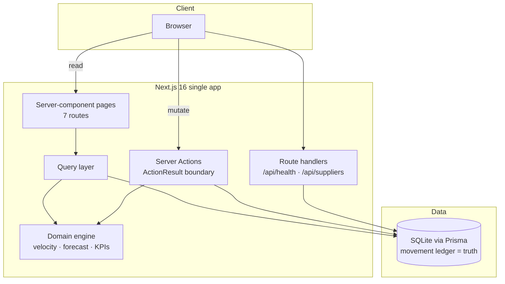

# Supply Chain Management

[](https://nextjs.org/)
[](https://react.dev/)
[](https://www.typescriptlang.org/)
[](https://tailwindcss.com/)
[](https://www.prisma.io/)
[](https://www.sqlite.org/)
[](https://bun.sh/)

An inventory-intelligence control room: live stock levels, AI replenishment suggestions, procurement lifecycle, supplier scorecards, and market trend signals — in one polished dashboard.

## Overview

Small retail and distribution teams lose money in the gap between "stock is fine" and "we just stockt out". This application closes that gap: it maintains a **movement ledger** as the single source of truth and derives every number you see — sales velocity, days of cover, reorder pressure, 30-day demand forecasts, and the AI replenishment suggestions — from that ledger at read time. Nothing on the dashboard is stale denormalized data; when stock moves, every KPI, chart, and suggestion reflects it on the next request.

The AI Suggestions engine watches each SKU's stock position against its reorder point and supplier lead times, composes human-readable reasoning from the real numbers, and lets you approve or dismiss suggestions straight into the procurement pipeline. A typical session: spot the out-of-stock lens on the dashboard stock feed, review the engine's reasoning, approve the suggested purchase order, and watch it flow through Procurement to delivery (which restocks the ledger automatically).

## Key Features

| ✨ | Feature | What it does |
|---|---------|--------------|
| 📊 | **Dashboard** | KPI tiles (Total SKUs, Low Stock severity, Pending POs, Inventory Value), 90-day inventory-value trend, top-5 fastest movers, priority stock feed |
| 📦 | **Products** | Searchable/filterable catalog with stock, reorder points, live velocity, and supplier per SKU |
| 🔍 | **Product detail** | Stat tiles, replenishment policy, stock-level history chart, 30-day demand forecast with confidence band, purchase-order history |
| 🤖 | **AI Suggestions** | Engine-generated replenishment recommendations with expandable, number-backed reasoning; approve or dismiss inline |
| 🛒 | **Procurement** | Full purchase-order lifecycle (Suggested → Approved → Delivered/Cancelled) with guarded transitions; delivery writes stock + ledger |
| 🏭 | **Suppliers** | Partner scorecards with ratings, contacts, payment terms, lead times, and product counts |
| 📈 | **Market Trends** | Category demand signals (score gauges, quarter-over-quarter change, sources) with summary stats |
| 🔐 | **Auth** | Email/password sign-in (scrypt hashes, HMAC session cookies) with public read-only browsing |
| ➕ | **New Product** | Complete creation dialog: pricing, stock policy, supplier linkage — opening stock lands in the ledger |
| 🩺 | **Health probe** | `GET /api/health` liveness + database check |

## Architecture

| Layer | Technology | Version | Purpose |
|-------|------------|---------|---------|
| Web framework | Next.js (App Router) | 16 | Server components, server actions, routing |
| UI runtime | React | 19 | Component model |
| Language | TypeScript (strict) | 5 | Type safety end-to-end, no `any` |
| Styling | Tailwind CSS | 4 (CSS-first `@theme`) | Brand tokens (orange/black/white) |
| UI primitives | shadcn/ui + Lucide | — | Accessible components and icons |
| Charts | Recharts | 2 | Inventory trend, stock history, forecast band |
| ORM | Prisma | 6 | Schema, migrations, typed client |
| Database | SQLite (file) | 3 | Zero-config local persistence (PostgreSQL-ready schema) |
| Validation | Zod | 4 | Action input validation |
| Runtime | Bun | ≥1.1 | Install, run, scripts |



**Architectural principles**

1. **Layer direction:** app → server (queries/actions) → domain (pure) → db. The domain layer has zero I/O.
2. **Derived analytics:** velocity/KPIs/forecasts/reasoning are computed from the ledger — never stored.
3. **ActionResult boundary:** actions validate with Zod and return typed results; errors never cross as exceptions.
4. **Integer money:** all amounts are cents; floats never touch money.
5. **Honest AI text:** suggestion reasoning is composed from live numbers with four truth branches.

## File Hierarchy

```
📂 supply-chain-management/
├── 📂 docs/
│   └── 📂 screenshots/            ← verified dev-server captures of every page
├── 📂 prisma/
│   ├── 📄 schema.prisma           ← data model (6 tables, minor-unit money)
│   └── 📄 seed.ts                 ← idempotent demo data + engineered ledger
├── 📂 scripts/
│   └── 📄 verify-analytics.ts     ← KPI regression check vs reference values
├── 📂 src/
│   ├── 📂 app/
│   │   ├── 📄 layout.tsx           ← root shell (Inter, session, AppShell)
│   │   ├── 📄 page.tsx             ← Dashboard
│   │   ├── 📂 products/            ← catalog + [id] detail
│   │   ├── 📂 ai-suggestions/      ← engine recommendations
│   │   ├── 📂 purchase-orders/     ← procurement table
│   │   ├── 📂 suppliers/           ← partner scorecards
│   │   ├── 📂 market-trends/       ← category signals
│   │   └── 📂 api/                 ← health + suppliers endpoints
│   ├── 📂 components/
│   │   ├── 📂 app/                 ← shell, KPI cards, charts, dialogs, filters
│   │   └── 📂 ui/                  ← shadcn/ui primitives
│   ├── 📂 domain/                  ← pure logic: replenishment, money, result, types
│   ├── 📂 server/                  ← queries.ts (reads) + actions.ts (mutations)
│   └── 📂 lib/                     ← db client, session, env, utils
├── 📄 AGENTS.md                    ← agent onboarding cheat-sheet
├── 📄 CLAUDE.md                    ← agent operating contract
├── 📄 Project_Architecture_Document.md ← full blueprint with ADRs
├── 📄 .env.example                 ← environment contract
└── 📄 package.json                 ← scripts (dev/lint/typecheck/db:*)
```

## Quick Start

Requires **Bun ≥ 1.1** (or Node ≥ 20 with `npm` substitutions) and any modern OS.

1. **Install dependencies**

   ```bash
   bun install
   ```

2. **Configure environment**

   ```bash
   cp .env.example .env
   ```

   The default `DATABASE_URL="file:../db/custom.db"` works out of the box (resolves against `prisma/` to `<repo>/db/custom.db`).

3. **Create the schema and demo data**

   ```bash
   bun run db:push
   bun run db:seed
   ```

4. **Start the dev server**

   ```bash
   bun run dev
   ```

   Open http://localhost:3000.

### Verify Setup

```bash
bun run lint && bun run typecheck   # both exit 0
bun run verify:analytics            # reference KPI checks pass
curl http://localhost:3000/api/health
# {"status":"ok","database":"up",...}
```

**Demo sign-in:** `demo@supplychain.local` / `demo-password` (or the account you seeded via `SEED_DEMO_EMAIL` / `SEED_DEMO_PASSWORD`).

## Environment Variables

| Variable | Required | Default | Purpose |
|----------|----------|---------|---------|
| `DATABASE_URL` | ✅ | — | SQLite file URL (or PostgreSQL URL after switching the Prisma provider) |
| `SESSION_SECRET` | prod | dev placeholder | HMAC secret for session cookies (`openssl rand -base64 32`) |
| `SEED_DEMO_EMAIL` | ⬜ | `demo@supplychain.local` | Demo account email created by the seed |
| `SEED_DEMO_PASSWORD` | ⬜ | `demo-password` | Demo account password |

## Testing

| Check | Command | Notes |
|-------|---------|-------|
| Static gates | `bun run lint && bun run typecheck` | No DB required |
| KPI regression | `bun run verify:analytics` | Asserts the seeded ledger reproduces reference values: velocities 1.5/1.2/0.8/0.7/0.4/0.0, low-stock −1, 11 suggestions, series integrity |
| Golden-path E2E | Manual browser pass | Sign in → create product → approve suggestion → sign out (screenshots in `docs/screenshots/`) |

## Design System

| Token | Value | Usage |
|-------|-------|-------|
| `--primary` | `#F97316` | Brand orange: active tab, CTAs, chart line, inventory-value card |
| `--background` | `#F3F4F6` | App background |
| `--foreground` | `#111827` | Primary text |
| `--destructive` | `#EF4444` | Alerts, out-of-stock, declining trends |
| `--success` | `#22C55E` | Rising trends, approved states |
| `--secondary` | `#E5E7EB` | Inactive nav pills, surfaces |
| Radius | `1rem` (cards `2rem`, content container `2rem+`) | Rounded, friendly geometry |

Typography: **Inter** (next/font), extrabold KPI numerals, medium labels, monospace SKUs and order numbers.

## Deployment

The production build is a standalone Next.js server:

```bash
bun run build
bun run start        # serves on :3000 (NODE_ENV=production)
```

Before going public: set a strong `SESSION_SECRET`, back or migrate the SQLite file (or switch the Prisma datasource to PostgreSQL — the schema is portable), and put the app behind TLS. `/api/health` is the readiness probe for your load balancer.

## Project Status

| Phase | Status | Key Deliverables |
|-------|--------|------------------|
| Foundation (schema, domain, seed) | ✅ Complete | 6 models, replenishment engine, engineered ledger |
| All 7 pages + interactions | ✅ Complete | Dashboard, Products(+detail), AI Suggestions, Procurement, Suppliers, Market Trends |
| Mutations & auth | ✅ Complete | Server actions, status machine, scrypt auth, session cookies |
| Documentation set | ✅ Complete | README, AGENTS, CLAUDE, Project_Architecture_Document, .env.example |
| Verified E2E | ✅ Complete | Browser-verified flows, screenshots in `docs/screenshots/` |

## Troubleshooting

| Issue | Solution |
|-------|----------|
| `Invalid server environment: DATABASE_URL is required` | Copy `.env.example` to `.env` and set the URL |
| Prisma "database not found" | Relative `file:` URLs resolve against `prisma/schema.prisma` — keep `file:../db/custom.db` |
| KPIs look wrong after editing the seed | Run `bun run db:seed && bun run verify:analytics`; the ledger builder throws a precise error on impossible specs |
| Login fails with the demo account | The seed only (re)creates the account it knows — re-run with `SEED_DEMO_EMAIL`/`SEED_DEMO_PASSWORD` set |
| Suggestion "Approve" does nothing | Check the action toast; status transitions are guarded (terminal states cannot move) |

## License

Private project of nordeim — all rights reserved.
