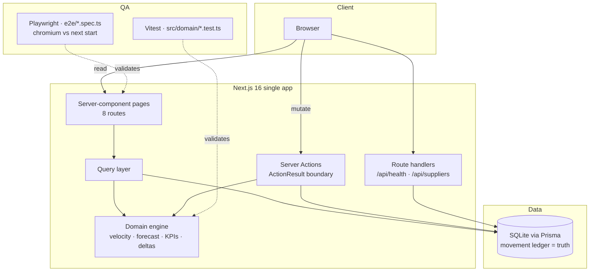

# Supply Chain Management

[](https://nextjs.org/)
[](https://react.dev/)
[](https://www.typescriptlang.org/)
[](https://tailwindcss.com/)
[](https://www.prisma.io/)
[](https://www.sqlite.org/)
[](https://bun.sh/)

[](https://vitest.dev/)
[](https://playwright.dev/)
[](https://github.com/nordeim/supply-chain-management/actions/workflows/ci.yml)

An inventory-intelligence control room: live stock levels, AI replenishment suggestions, procurement lifecycle, supplier scorecards, and market trend signals — in one polished dashboard. Built as a faithful clone of the reference app, with its design tokens, geometry, data, and read-only interaction model reproduced exactly.

## Overview

Small retail and distribution teams lose money in the gap between "stock is fine" and "we just stockt out". This application closes that gap: it maintains a **movement ledger** as the single source of truth and derives every number you see — sales velocity, days of cover, reorder pressure, 30-day demand forecasts, and the AI replenishment suggestions — from that ledger at read time. Nothing on the dashboard is stale denormalized data; when stock moves, every KPI, chart, and suggestion reflects it on the next request.

The AI Suggestions engine watches each SKU's stock position against its reorder point and supplier lead times, and lists one suggestion per pending purchase order with its projected cost, delivery date, and expandable reasoning composed from the real numbers. A typical session: read the asymmetric KPI grid (black Total SKUs and orange Inventory Value tiles, tall Low Stock and Pending PO gauges), scan the stock feed's image cards for the out-of-stock lens and the 11 suggested orders, open a feed card's Review button to jump into the product's detail page (velocity, coverage, forecast), and click through Procurement rows to inspect the Order Details side panel. The reference app exposes no mutation controls on these surfaces — the clone matches that interaction model exactly, while the underlying server action layer (approve/dismiss/status transitions) remains available for programmatic use and is covered by unit tests.

## Key Features

| ✨ | Feature | What it does |
|---|---------|--------------|
| 📊 | **Dashboard** | Reference-asymmetric KPI grid (black Total SKUs + orange Inventory Value stack, tall Low Stock tick-scale + Pending PO semicircle gauge), 90-day dot-plot inventory-value chart, top-5 movers with 30-day delta badges, 12-card image stock feed |
| 📦 | **Products** | Searchable/filterable catalog with stock, reorder points, live velocity, and supplier per SKU, in reference row order |
| 🔍 | **Product detail** | Stat tiles, replenishment policy, stock-level history chart, 30-day demand forecast with confidence band, purchase-order history, one-decimal cost/price tiles |
| 🤖 | **AI Suggestions** | 11 engine-generated replenishment recommendations (table layout, reference totals/dates) with expandable reasoning — informational, like the reference |
| 🛒 | **Procurement** | 15 purchase orders with status filter, MM.DD.YY dates, and a click-through Order Details side panel (product, qty, total, unit cost, supplier, date) |
| 🏭 | **Suppliers** | Partner scorecards (Nordic first) that click through to per-supplier detail routes: stats, terms, products, recent POs |
| 📈 | **Market Trends** | 6 category demand signals (score gauges, quarter-over-quarter change, sources) with summary stats |
| 🔐 | **Auth** | Email/password sign-in (scrypt hashes, HMAC session cookies) with Google-button and forgot-password affordances like the reference |
| ➕ | **New Product** | Complete creation dialog: image upload, pricing, stock policy, supplier linkage — opening stock lands in the ledger |
| 🩺 | **Health probe** | `GET /api/health` liveness + database check |

## Architecture

| Layer | Technology | Version | Purpose |
|-------|------------|---------|---------|
| Web framework | Next.js (App Router) | 16 | Server components, server actions, routing |
| UI runtime | React | 19 | Component model |
| Language | TypeScript (strict) | 5 | Type safety end-to-end, no `any` |
| Styling | Tailwind CSS | 4 (CSS-first `@theme`) | Brand tokens (orange/black/white) |
| UI primitives | shadcn/ui + Lucide | — | Accessible components and icons |
| Charts | Recharts | 2 | Inventory trend, stock history, forecast band |
| ORM | Prisma | 6 | Schema, migrations, typed client |
| Database | SQLite (file) | 3 | Zero-config local persistence (PostgreSQL-ready schema) |
| Validation | Zod | 4 | Action input validation |
| Unit tests | Vitest | 5 | Domain-layer regression (85 tests, TDD, coverage-gated) |
| E2E tests | Playwright | 1.63 | Golden-path browser suite against the production build (31 chromium tests) |
| Runtime | Bun | ≥1.1 | Install, run, scripts |



**Architectural principles**

1. **Layer direction:** app → server (queries/actions) → domain (pure) → db. The domain layer has zero I/O.
2. **Derived analytics:** velocity/KPIs/forecasts/reasoning are computed from the ledger — never stored.
3. **ActionResult boundary:** actions validate with Zod and return typed results; errors never cross as exceptions.
4. **Integer money:** all amounts are cents; floats never touch money.
5. **Honest AI text:** suggestion reasoning is composed from live numbers with four truth branches.

## File Hierarchy

```
📂 supply-chain-management/
├── 📂 docs/
│   └── 📂 screenshots/            ← verified captures of every page (11 images)
├── 📂 e2e/                        ← Playwright specs (7 files, 31 chromium tests)
├── 📂 prisma/
│   ├── 📄 schema.prisma           ← data model (6 tables, minor-unit money)
│   └── 📄 seed.ts                 ← idempotent demo data + engineered ledger
├── 📂 public/
│   └── 📂 products/               ← product images for stock-feed cards
├── 📂 scripts/
│   └── 📄 verify-analytics.ts     ← KPI regression check vs reference values
├── 📂 src/
│   ├── 📂 app/
│   │   ├── 📄 layout.tsx           ← root shell (Inter, session, AppShell)
│   │   ├── 📄 page.tsx             ← Dashboard (asymmetric KPI grid, dot plot, stock feed)
│   │   ├── 📂 products/            ← catalog + [id] detail
│   │   ├── 📂 ai-suggestions/      ← engine recommendations (table layout)
│   │   ├── 📂 purchase-orders/     ← procurement table + Order Details panel
│   │   ├── 📂 suppliers/           ← scorecards + [id] detail route
│   │   ├── 📂 market-trends/       ← category signals
│   │   └── 📂 api/                 ← health + suppliers endpoints
│   ├── 📂 components/
│   │   ├── 📂 app/                 ← shell, KPI cards/gauges, dot plot, stock feed,
│   │   │                            order-details panel, procurement table, dialogs
│   │   └── 📂 ui/                  ← shadcn/ui primitives
│   ├── 📂 domain/                  ← pure logic + TDD unit tests
│   │   ├── 📄 replenishment(.test).ts · money(.test).ts · result(.test).ts · types.ts
│   ├── 📂 server/                  ← queries.ts (reads) + actions.ts (mutations)
│   └── 📂 lib/                     ← db client, session, env, utils
├── 📄 AGENTS.md                    ← agent onboarding cheat-sheet
├── 📄 CLAUDE.md                    ← agent operating contract
├── 📄 Project_Architecture_Document.md ← full blueprint with ADRs
├── 📄 .env.example                 ← environment contract
├── 📄 vitest.config.ts             ← unit test config (node env, @ alias)
├── 📄 playwright.config.ts         ← E2E config (next start :3002, chromium+webkit)
└── 📄 package.json                 ← scripts (dev/lint/typecheck/db:*/test/test:e2e)
```

## Quick Start

Requires **Bun ≥ 1.1** (or Node ≥ 20 with `npm` substitutions) and any modern OS.

1. **Install dependencies**

   ```bash
   bun install
   ```

2. **Configure environment**

   ```bash
   cp .env.example .env
   ```

   The default `DATABASE_URL="file:../db/custom.db"` works out of the box (resolves against `prisma/` to `<repo>/db/custom.db`).

3. **Create the schema and demo data**

   ```bash
   bun run db:push
   bun run db:seed
   ```

4. **Start the dev server**

   ```bash
   bun run dev
   ```

   Open http://localhost:3000.

### Verify Setup

```bash
bun run lint && bun run typecheck   # both exit 0
bun run test                        # 85 domain/env unit tests pass
bun run test:coverage               # same suite + coverage thresholds (95/85/95/95)
bun run verify:analytics            # reference KPI checks pass
curl http://localhost:3000/api/health
# {"status":"ok","database":"up",...}
```

**Demo sign-in:** `demo@supplychain.local` / `demo-password` (or the account you seeded via `SEED_DEMO_EMAIL` / `SEED_DEMO_PASSWORD`).

## Environment Variables

| Variable | Required | Default | Purpose |
|----------|----------|---------|---------|
| `DATABASE_URL` | ✅ | — | SQLite file URL (or PostgreSQL URL after switching the Prisma provider) |
| `SESSION_SECRET` | prod | dev placeholder | HMAC secret for session cookies (`openssl rand -base64 32`) |
| `SEED_DEMO_EMAIL` | ⬜ | `demo@supplychain.local` | Demo account email created by the seed (also read by the auth E2E spec) |
| `SEED_DEMO_PASSWORD` | ⬜ | `demo-password` | Demo account password |
| `E2E_PORT` | ⬜ | `3002` | Port for the Playwright `next start` web server |
| `E2E_BASE_URL` | ⬜ | `http://127.0.0.1:3002` | Reuse an external server instead of booting one |

## Testing

| Check | Command | Notes |
|-------|---------|-------|
| Static gates | `bun run lint && bun run typecheck` | No DB required |
| Unit (TDD) | `bun run test` | 85 Vitest tests in `src/domain/*.test.ts` + `src/lib/env.test.ts` — money formatting, ActionResult, session guard, env contract, velocity windows, reorder math, 30-day deltas, forecast/ledger replay, gauge/scale helpers, reference reasoning sentence |
| KPI parity | `bun run verify:analytics` | Asserts the seeded ledger reproduces reference values: velocities 1.5/1.2/0.8/0.7/0.4/0.0, low-stock −1, 11 suggestions, inventory value $202,610 (cost basis), movers badges +2/−1/0/+1/+2 |
| E2E | `bun run build && bun run test:e2e` | 31 Playwright chromium tests in `e2e/` against `next start` (not dev): every page, sign-in/out, search, filters, Order Details panel, supplier detail, reference row/data assertions. Webkit is configured but needs its system libs — run `npx playwright test --project=chromium` where they're unavailable |

## Design System

Extracted from the live reference app via computed-style inspection (Session 2 parity audit):

| Token | Value | Usage |
|-------|-------|-------|
| `--primary` | `#FF9000` | Brand orange: active nav pill, gauge markers, Inventory Value tile, chart dots on positive trend |
| `--background` | `#EFEFEF` | App background — content sits directly on gray, no white container |
| `--foreground` | `#111111` | Primary text; black KPI tile uses the same near-black |
| `--primary-foreground` | `#0F1729` | Dark navy on orange/CTA surfaces, New Product label |
| `--muted-foreground` | `#343434` | Secondary labels, table headers |
| `--destructive` | `#F13A15` | Low-stock dot, out-of-stock tag, negative movers badges |
| `--success` | `#22C55E` | Positive movers badges, approved states |
| Inactive pill | `#DFDFDF` | Inactive nav/sidebar pills |
| Card radius | `32px` | White cards (chart sections, stock feed, dialog) on the gray background |

Typography: **Inter** (next/font) for headings, system-ui stack for body — matching the reference. KPI numerals are large and tight; SKUs and order numbers render monospace.

## Deployment

The production build is a standalone Next.js server:

```bash
bun run build
bun run start        # serves on :3000 (NODE_ENV=production)
```

Before going public: set a strong `SESSION_SECRET`, back or migrate the SQLite file (or switch the Prisma datasource to PostgreSQL — the schema is portable), and put the app behind TLS. `/api/health` is the readiness probe for your load balancer.

## Project Status

| Phase | Status | Key Deliverables |
|-------|--------|------------------|
| Foundation (schema, domain, seed) | ✅ Complete | 6 models, replenishment engine, engineered ledger |
| All pages + interactions | ✅ Complete | 8 routes incl. supplier detail, all reference components |
| Mutations & auth | ✅ Complete | Server actions, status machine, scrypt auth, session cookies |
| Documentation set | ✅ Complete | README, AGENTS, CLAUDE, Project_Architecture_Document, .env.example |
| Test suites | ✅ Complete | Vitest (85 unit, TDD, coverage thresholds), Playwright (31 chromium E2E), analytics verifier, GitHub Actions CI |
| Session 2 parity remediation | ✅ Complete | Reference tokens (#FF9000/#EFEFEF/32px), asymmetric KPI grid, dot-plot chart, image stock feed, reference data ($202,610), informational PO panel, supplier detail routes |
| Hardening (session 4, PAD v1.2) | ✅ Complete | Session guard on admin actions (ADR-008), wired env contract (production refuses insecure SESSION_SECRET), coverage thresholds (95/85/95/95), GitHub Actions CI |
| Verified E2E | ✅ Complete | Browser-verified flows, screenshots in `docs/screenshots/` |

## Troubleshooting

| Issue | Solution |
|-------|----------|
| `Invalid server environment: DATABASE_URL is required` | Copy `.env.example` to `.env` and set the URL |
| Prisma "database not found" | Relative `file:` URLs resolve against `prisma/schema.prisma` — keep `file:../db/custom.db` |
| KPIs look wrong after editing the seed | Run `bun run db:seed && bun run verify:analytics`; the ledger builder throws a precise error on impossible specs |
| Login fails with the demo account | The seed only (re)creates the account it knows — re-run with `SEED_DEMO_EMAIL`/`SEED_DEMO_PASSWORD` set |
| Production sign-in fails with `SESSION_SECRET must be set...` | The env contract is now enforced at session-signing time — set a real secret (`openssl rand -base64 32`) in `.env` for production boots |
| Playwright: webkit tests fail to launch | Webkit needs OS system libraries; run `npx playwright test --project=chromium` or `npx playwright install-deps webkit` on a host with root |
| E2E port 3002 already in use | Set `E2E_PORT`/`E2E_BASE_URL` (see Environment Variables) |
| Dashboard 500 after switching dev↔build | Stale Turbopack cache — `rm -rf .next` and restart the dev server |

## License

Private project of nordeim — all rights reserved.
